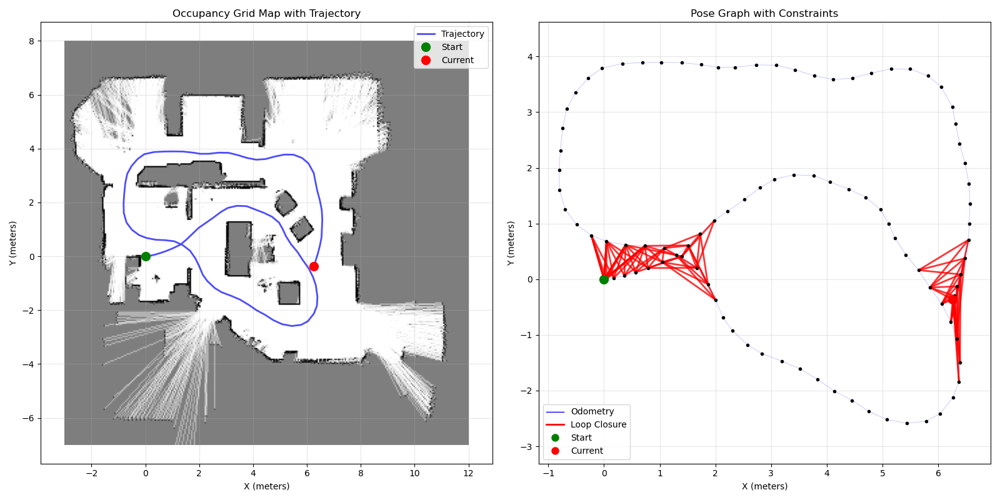

# Pose-Graph SLAM

> Implementing SLAM wasn't my goal, at least not initially. I was mostly just exploring the Raspibot's capabilities, what with its fancy Optical Tracking Odometry Sensor and Lidar. I wanted to see what it could do, and I learned lots along the way. But not surprisingly, that learning path is strewn with gobs of obsolete code that no longer has a purpose, and got shoved off into a folder. Someday, when I have more time, I'll sort through it. Sure I will. Basic mapping code -> stuck it in the *early_code/* folder. Investigations into ICP using data from a small loop in office -> shoved it into  the *office_loop/* folder. Anyway, eventually, (with some help from Claude), I managed to create this working Python based Pose-Graph SLAM program.

## Project Overview

* Python based 2D SLAM
* Pose-Graph optimization
* Scan & pose data post-processing offline
* Loop Closure detection with Point-to-Point ICP (Iterative Closest Point) for scan matching
* Occupancy Grid Map using Log-Odds weighting
* Visualization showing Pose Graph, robot path, and loop closures

## Programs

0. *service_ctrl.py*
    * Provides a programmatic way to start and stop services on the Raspibot

1. *scan_grabber.py*
    * Starts the robot's scanner and odometer services
    * Collects scan & pose data, with timestamps @ ~1/s
        * pose: x, y, heading, timestamp, x rate, y rate, heading rate
        * scan (per ray): dist, angle, timestamp
    * Saves the data in a file *scan_data.pkl*.
    * Stops the robot's scanner and odometer services

2. *process_data.py*
    * Loads scan & pose data from *scan_data.pkl*
    * Using timestamps, calculates the pose at the exact time of each scan
    * Saves those scans and poses (without timestamps and rates) in .npz format

3. *slam.py*
    * Builds pose graph, using ICP to refine poses
    * Detects loop closures and optimizes, periodically rebuilding pose graph
    * Final optimizaton
    * Save and display results

4. *display_map.py*
    * Displays just the OGM
    * Use the button on the display window to save it as a .png file

## Data storage

* All (per run) data goes into the `SLAM_Data/` folder
* It's recommended to copy all the data out and archive it, since it will get overwritten by the next robot run.

## Workflow

1. Prepare the robot and the environment
    * Make sure the SLAM_Data/ folder is empty or doesn't have anything in it that you care about.
    * Mask any reflective surfaces like glass doors or shiny appliances
    * Position the robot in it's Home position
    * Power up the robot
2. Run scan_grabber: `uv run scan_grabber.py`
    * This will start the scan and odometer programs on the robot
    * This takes a few seconds. The odometer program has to go through a calibration
    * Drive the robot along a path through the room using the joystick
    * When finished, ctrl+c to stop the program and stop the scan and odom services
    * Data gets stored in the file scan_data.pkl
3. Now process the data: `python process_data.py` so that it is in the format needed by the slam program.
4. Run the SLAM program: `python slam.py`
    * This takes a little while, but it will give you lots of feedback to let you know how it's progressing.
    * You will see two figures, side by side. On the left will be the Occupancy Grid Map that was created, overlayed with the path of the robot. On the right is the Pose Graph showing loop closures.
5. Run display_map.py to show just the OGM. Use the button on the display window to save it as a .png file.

That's it! You'll get a beautiful map that is suitable for path planning and path following.

## Parameters

* You'll want to specify your map parameters:
    * width
    * height
    * resolution
    * origin
* You may also want to refine some slam parameters:
    * max_correspondence_distance to avoid unwanted loop detections (through walls, for example)
    

## Dependencies

* asyncio
* aiomqtt
* numpy
* matplotlib
* scipy
